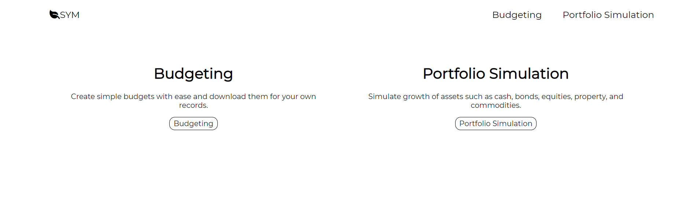
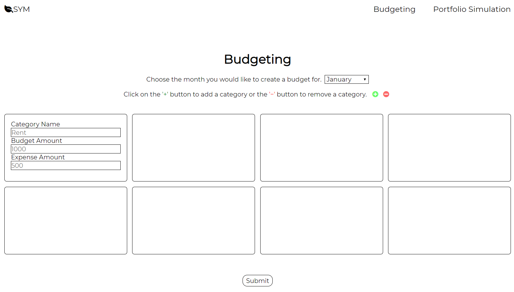
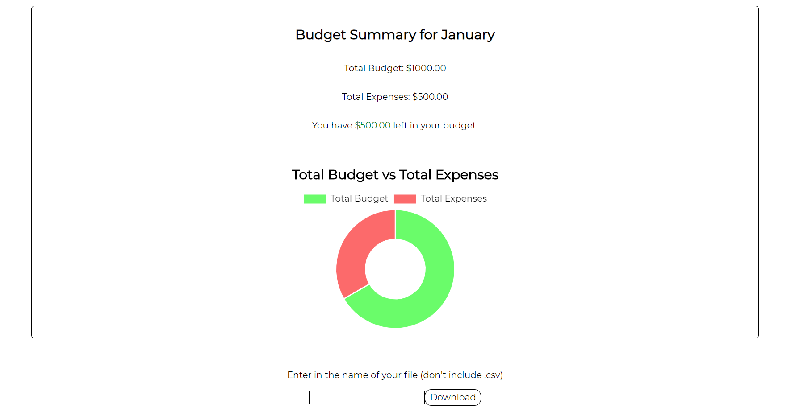
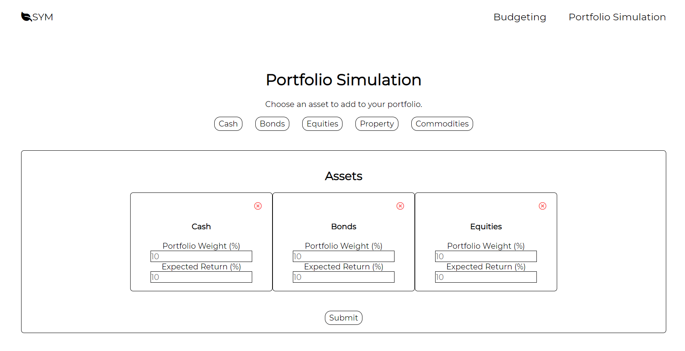

# SYM

# Demo
https://kchao1910.github.io/SYM/

# Overview
SYM is a web application that creates simple budgets and calculates the annual return of a simulated portfolio.

# Senarios

Senario 1: Bob. 
Bob is a young man trying to figure out his life. He is a college student who over the course of several semesters finds himself stumbling on his finances. He has taken out student loans and eats cup noodles every weekday. On the weekends, he plops himself on the couch to watch Game of Thrones. Before bed he looks at some inspirational Youtube videos and he decides that its time take control of his finances. He searches "budgeting sites" on the internet and comes across <b>SYM</b>. He starts to name his budget, create categories, enters in his budget and expenses, and clicks the download button. Thus, Bob is able to keep track of his expenses. 

Senario 2: Julia. 
Julia is the head chef a newly opened restaurant. One of her responsibilities is to order the ingredients they need and to keep records of the purchase price. Initially she tries to manually write down every thing in her notebook, but as the day goes on it gets harder to write down every expense. Her friend, a fellow chef, recommends her to use <b>SYM</b>. Julia goes to <b>SYM</b> and starts typing down the expenses for the restaurant and downloading the budgets to keep a record. She frequently uses the chart to help her visualize where they can cut down on expenses. At the end of the day, Julia is able to keep her finances organized without the hassle of writing things down.

# Non Goals
1. Login Page/ Registration
2. Server Side Support

# SYM Screen Specifications
SYM consists of 3 main pages. Screens displayed here are not indicative of the final product, but provide a visual of the application and functionality.

# Home Page
The home page serves 3 main purposes.
1. Allow users to learn about the two main functionalities.
2. Allow users to create a budget.
3. Allow users to simulate the return of a portfolio.

# Budgeting Page
The budgeting page looks like this.

The users can do the following:
1. Select the month for the budget they want to create.
2. Add a category to their budget.
4. Remove a category from their budget.
3. Enter in the category name, if the category name includes anything except for numbers and letters the application will prevent the user from submitting.
4. Enter in the budget amount and expenses, if the budget or expense is not an integer or float the application will prevent the user from submitting.
5. Download a CSV file of their budget.

On submission the bottom part of the page will look like this.

As an option the user can name their budget file and click the download button to download their budget as a CSV file.

# Portfolio Page
The portfolio page looks like this.

To create a portfolio simulation the user must do the following:
1. Click on an asset or assets to add to their portfolio.
2. Enter in the portfolio weight and expected annual return, if the input for these fields does not match an integer or float the user will not be able to submit their form.
3. If a user wants to remove an asset from their portfolio they can click on the red x mark inside a circle to remove it.

On submission the button portfolio page should look like this.
